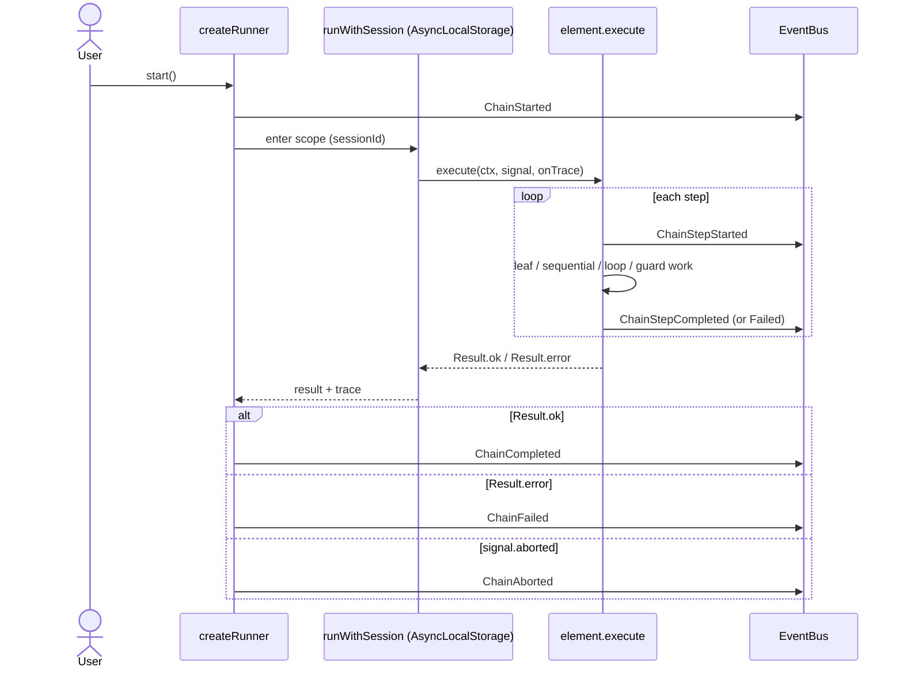

# Chain framework

Five concepts under `src/application/chain/`: `element` (interface) + four factory functions
`leaf`, `sequential`, `loop`, `guard`. Every primitive returns an `Element<TCtx>`. The trace
is built into `execute` itself (`Result<{ ctx, trace }, { error, trace }>`).

See `.claude/docs/KERNEL-DESIGN.md` for the typed contract.

## What's not in the framework

| Concept                   | Why not                                           | Where it lives instead                                               |
| ------------------------- | ------------------------------------------------- | -------------------------------------------------------------------- |
| `retry`                   | Adapter-level concern.                            | `src/integration/ai/providers/_engine/rate-limit-backoff.ts`         |
| `onError` / `conditional` | Branching belongs inside a use case or a `guard`. | A use case returns; `guard(name, predicate, body)` skips.            |
| `parallel` / `fanOut`     | Implement runs strictly sequential in v0.7.0.     | `sequential` of per-task subchains in planner-assigned `Task.order`. |

## One run, end to end

Late subscribers added after a terminal event get a synthetic replay of every recorded
`step` + the matching terminal event — UI re-attach is lossless. The trace is ring-buffered
at `MAX_TRACE_ENTRIES = 20_000` so multi-task implement runs don't grow without bound.

## Runner status

`idle → running → (completed | failed | aborted)`. Pre-start `abort()` jumps `idle → aborted`
directly (no `started` event). All three terminals are absorbing.
