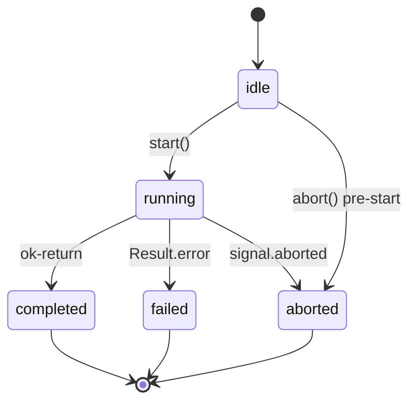
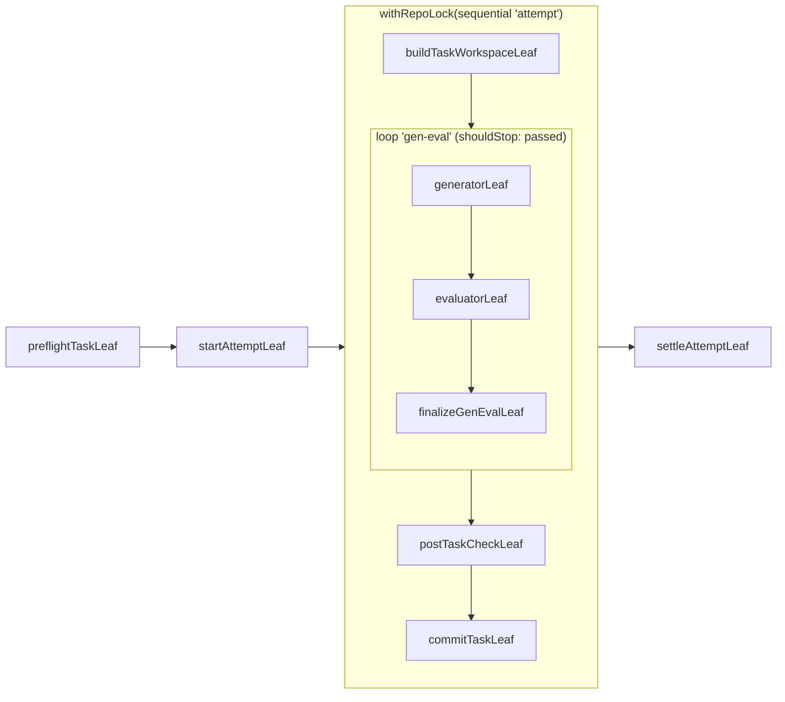

# Chain framework

Five concepts under `src/application/chain/`: `element` (interface) + four factory functions
`leaf`, `sequential`, `loop`, `guard`. Every primitive returns an `Element<TCtx>`, composites
carry their `children`, the trace is built into `execute` itself
(`Result<{ ctx, trace }, { error, trace }>`). See `.claude/docs/KERNEL-DESIGN.md` for the
typed contract — the diagrams below cover the two parts a picture genuinely helps with: the
runner status machine, and what a real composition looks like.

## What's NOT in the framework

| Concept                   | Why not                                                                  | Where it lives instead                                                                                                                                       |
| ------------------------- | ------------------------------------------------------------------------ | ------------------------------------------------------------------------------------------------------------------------------------------------------------ |
| `retry`                   | Adapter-level concern; would duplicate at framework layer                | `src/integration/ai/providers/_engine/rate-limit-backoff.ts` (exponential backoff on `RateLimitError`); per-spawn cap is `settings.harness.rateLimitRetries` |
| `onError` / `Conditional` | Branching belongs inside a use case or in a `guard` over the branch body | A use case decides + returns; `guard(name, predicate, body)` skips the body when needed                                                                      |
| `parallel` / `fanOut`     | Implement runs strictly sequential in v0.7.0                             | `topologicalReorder` + `sequential` of per-task subchains                                                                                                    |

## Runner lifecycle

`createRunner({ id, element, initialCtx })` from `src/application/chain/run/runner.ts` wraps
one `element.execute()` call.

Event stream (`subscribe(listener)`):

- **Success:** `started → step* → completed`
- **Failure:** `started → step* → failed`
- **Pre-run abort:** `aborted` only (no `started`)
- **Mid-run abort:** `started → step* → aborted`

Late subscribers added after a terminal state receive a synthetic replay of every recorded
`step` event plus the matching terminal event — UI re-attach is lossless. The trace is ring-
buffered at `MAX_TRACE_ENTRIES = 20_000` so multi-task implement runs don't grow without
bound.

## Session scope

The runner enters `runWithSession(id, …)` (from `src/application/session/session.ts`) before
calling `element.execute(...)`. Deep adapter code reads `currentSessionId()` via
`AsyncLocalStorage` to tag every emitted log / signal with the owning session. No explicit
threading required.

## Examples

The implement flow's per-task gen-eval body is the most representative composition:

See `.claude/docs/KERNEL-DESIGN.md` for the full contract.
