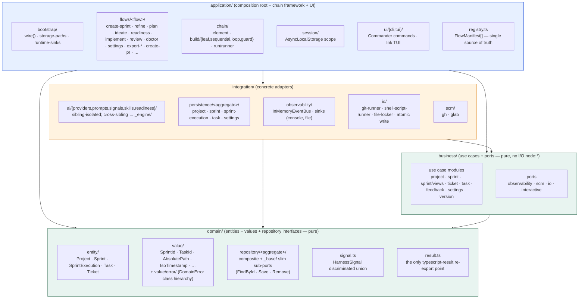

# Module layout

Four-module Clean Architecture. Dependencies point one way; `domain` and `business` are
pure (no I/O-bearing `node:*`). ESLint `no-restricted-imports` in `eslint.config.ts`
enforces every direction.

## Layer rules (enforced by ESLint)

| Layer          | May import from           | I/O-bearing `node:*` |
| -------------- | ------------------------- | -------------------- |
| `domain/`      | nothing outside `domain/` | ❌ banned            |
| `business/`    | `domain/` only            | ❌ banned            |
| `integration/` | `domain/` + `business/`   | ✅ allowed           |
| `application/` | anywhere                  | ✅ allowed           |

Pure `node:*` modules (`node:path`, `node:url`, `node:util`, `node:assert`, `node:crypto`)
are allowed in every layer.

## Other fenced rules

- **No `class` outside `src/domain/value/error/`** — entities and use cases are interfaces +
  factory functions.
- **No barrel `index.ts` files** — `export *` is banned; every import names what it pulls in.
- **Sibling-isolation** under `integration/ai/<concept>/` (providers, signals, prompts,
  readiness, skills), `business/<module>/`, and `application/flows/<flow>/`. Cross-sibling
  access goes through a shared `_engine/` sub-namespace.
- **Port-shaped types** (`*Port`, `*Adapter`, `*Provider`, `*Sink`, `*Loader`, `*Probe`, …)
  MUST live in `_engine/`.
- **Business consumes slim sub-ports**, not composite `*Repository` types. Composite types
  satisfy the slim ones; the composition root wires them.

See `.claude/docs/ARCHITECTURE.md` for the full module inventory and
`eslint.config.ts` for the concrete fence rules.
