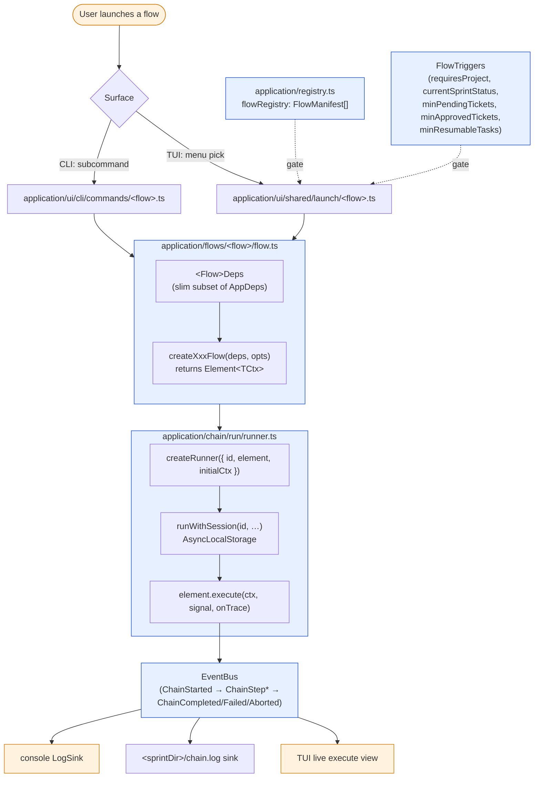

# Flow lifecycle

Every user-launchable workflow is a `FlowManifest` entry in `src/application/registry.ts`.
The CLI command builder, the TUI menu, and the launcher all read from that one array — add
a flow by appending one entry (use `pnpm gen:flow <name>` to scaffold the body).

## From registry to runner

Flow inventory (the 17 manifest entries) is in `.claude/docs/ARCHITECTURE.md` § Flow registry
and in the live `src/application/registry.ts`. `FlowTriggers` (the pre-launch predicates that
gate the TUI menu) is described in the same section — it's a struct, not a diagram.
