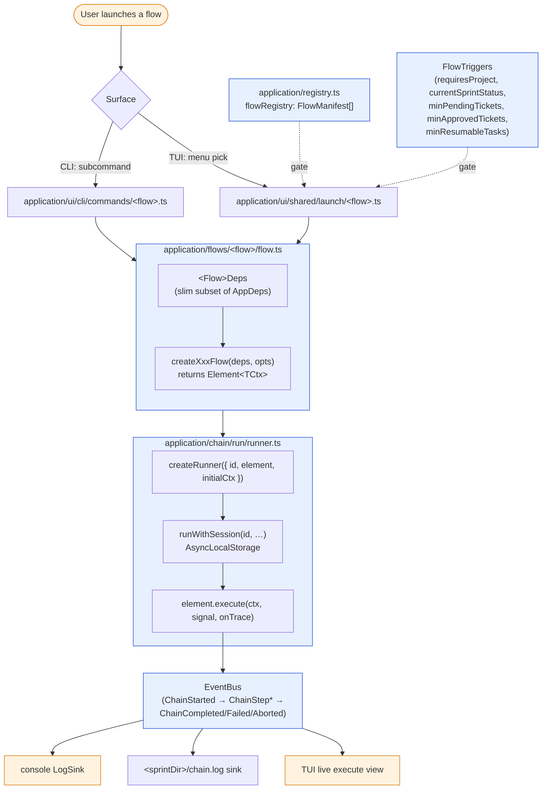
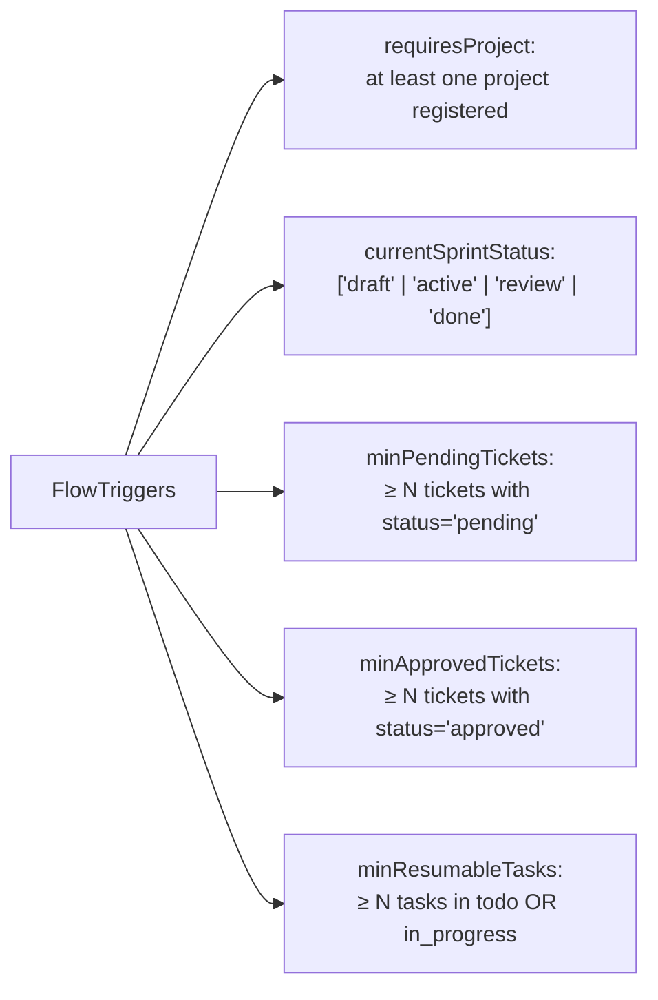

# Flow lifecycle

Every user-launchable workflow is a `FlowManifest` entry in `src/application/registry.ts`.
The CLI command builder, the TUI menu, and the launcher all read from that one array — add
a flow by appending one entry (use `pnpm gen:flow <name>` to scaffold the body).

## From registry to runner

## Flow inventory (from `registry.ts`)

| Flow id                        | Shape    | CLI? | What it does                                        |
| ------------------------------ | -------- | :--: | --------------------------------------------------- |
| `create-sprint`                | chain    |  ✗   | Interactive prompts; TUI only                       |
| `add-tickets`                  | chain    |  ✗   | Interactive loop; TUI only                          |
| `refine`                       | chain    |  ✗   | Per-ticket AI handoff; TUI only                     |
| `plan`                         | chain    |  ✗   | Interactive AI handoff; generates `tasks.json`      |
| `ideate`                       | chain    |  ✗   | Combines refine + plan in one AI session            |
| `readiness`                    | chain    |  ✗   | Writes provider-native context file (CLAUDE.md / …) |
| `detect-scripts`               | chain    |  ✗   | Setup / check script discovery                      |
| `detect-skills`                | chain    |  ✗   | Skill discovery                                     |
| `implement`                    | chain    |  ✗   | Genuinely needs the chain (gen-eval + retry)        |
| `review`                       | chain    |  ✗   | Apply-feedback loop                                 |
| `close-sprint`                 | use-case |  ✓   | `sprint close <id>` — review → done                 |
| `export-context`               | use-case |  ✓   | Render harness-context markdown                     |
| `export-requirements`          | use-case |  ✓   | Render approved-ticket requirements markdown        |
| `create-pr`                    | use-case |  ✓   | Open PR via `gh` / `glab`                           |
| `doctor`                       | use-case |  ✓   | Environment health check                            |
| `settings`                     | use-case |  ✓   | `settings show` / `set`                             |
| `ticket-add` / `ticket-remove` | use-case |  ✓   | CLI ticket mutators                                 |

**CLI surface is deliberately smaller than v0.6.x.** Interactive chains stay TUI-only by
design. The CLI exposes inspection + one-shot operations only. See `docs/api.md` (in the v2
source repo) for flag-level detail on the use-case commands.

## Triggers

Triggers are pre-launch readiness predicates. The TUI menu greys out flows whose triggers
aren't met and surfaces a one-line hint explaining the gap. Empty triggers means "always
available".
