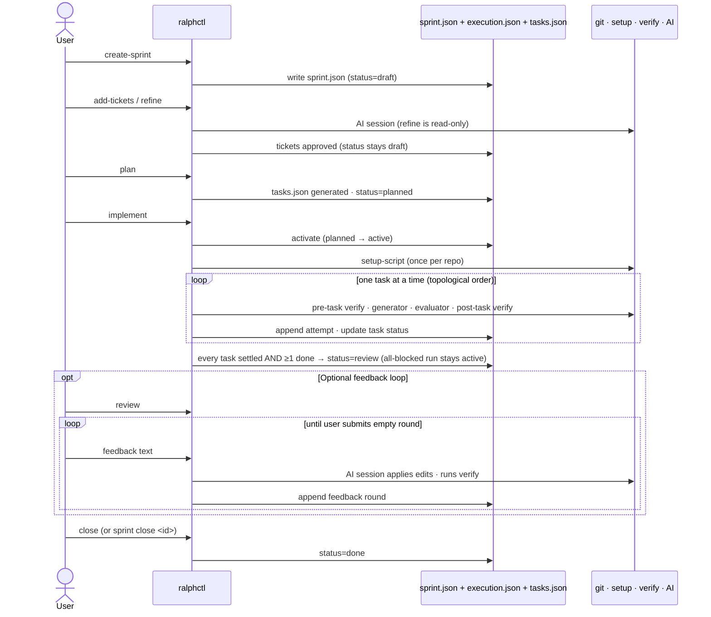

# Sprint lifecycle

A sprint moves through five states: `draft → planned → active → review → done`, plus one recovery edge
`review → active` — unblocking a task on a `review` sprint reverts it to `active` so the unblocked task
can be picked up on the next Implement run. (`plan` flips `draft → planned`; `implement` activates
`planned → active`.)

## A typical sprint, end to end



## Operation matrix

| Operation                  | draft | planned | active | review | done |
| -------------------------- | :---: | :-----: | :----: | :----: | :--: |
| Add / edit / remove ticket |   ✓   |    ✗    |   ✗    |   ✗    |  ✗   |
| Refine requirements        |   ✓   |    ✗    |   ✗    |   ✗    |  ✗   |
| Plan tasks                 |   ✓   |    ✗    |   ✗    |   ✗    |  ✗   |
| Implement                  |   ✗   |   ✓\*   |   ✓    |   ✗    |  ✗   |
| Review (apply feedback)    |   ✗   |    ✗    |   ✗    |   ✓    |  ✗   |
| Close (review → done)      |   ✗   |    ✗    |   ✗    |   ✓    |  ✗   |
| `sprint show / list`       |   ✓   |    ✓    |   ✓    |   ✓    |  ✓   |
| `task unblock`†            |   ✗   |    ✗    |   ✗    |   ✓    |  ✗   |

\*`implement` activates a `planned` sprint (`planned → active`) on first launch; an already-`active`
sprint passes through idempotently. A draft sprint must be planned first.

†`task unblock` (TUI `u` / `ralphctl task unblock`) on a `review` sprint reverts the sprint to `active`
(`revertSprintToActive`) so the newly-`todo` task is picked up on the next Implement run. A non-`review`
sprint passes through the reopen untouched (idempotent). An all-blocked run stays `active` — no review
state to revert.

## On-disk shape

```
<dataRoot>/sprints/<sprint-id>/
├── sprint.json          ← planning aggregate (tickets, status, project ref)
├── execution.json       ← runtime audit (branch, PR URL, per-repo setupRanAt)
├── tasks.json           ← task list with status + attempts
├── events.ndjson            ← EventBus trace (opt-in via RALPHCTL_DEBUG_TRACE)
├── progress.md          ← human-readable journal (one section per settled attempt)
├── logs/setup/          ← full setup-script stdout/stderr per repo
├── logs/verify/         ← full verify-script stdout/stderr per task per attempt
└── <flow>/<unit>/       ← per-spawn AI sandbox (prompt.md + signals.json + sidecars)
```

The split keeps planning mutations isolated from execution-time writes — corrupting
`tasks.json` does not lose the sprint plan.

## Backed by

- Entity: `src/domain/entity/sprint.ts` + `sprint-execution.ts`
- Repositories: `src/domain/repository/sprint/{sprint,sprint-execution}-repository.ts`
- Mutators:
  `src/business/sprint/{create-sprint,plan-sprint,activate-sprint,transition-sprint-to-review,transition-sprint-to-done}.ts`
- Schema: `src/integration/persistence/sprint/sprint.schema.ts` (zod, with `schemaVersion`)
