# Sprint lifecycle

A sprint moves through four states. The implement flow auto-activates a draft and
auto-transitions to review when every task is done. Only the close-sprint flow (or

```mermaid
stateDiagram-v2
  [*] --> draft: create-sprint flow

  draft --> draft: add-tickets · refine ·\nplan · ideate
  draft --> active: implement (auto-activate)\nor sprint activate <id>

  active --> active: implement (per-task settlement)
  active --> review: implement transitions\nwhen all tasks done

  review --> review: review flow\n(apply-feedback loop;\nempty input exits)
  review --> done: close-sprint flow\nor sprint close <id>

  done --> [*]

  note left of draft
    Planning phase
    Tickets accept add / refine / plan
    Tasks generated atomically by plan
  end note

  note right of active
    Execution phase
    Tasks transition todo → in_progress → done | blocked
    Implement is the ONLY flow that mutates code
  end note

  note right of review
    Optional feedback loop
    AI session resumes via persisted sessionId
    Check scripts re-run per round
  end note
```

`ralphctl sprint close <id>`) closes a sprint.



## Operation matrix

| Operation                       | draft | active | review | done |
| ------------------------------- | :---: | :----: | :----: | :--: |
| Add / edit / remove ticket      |   ✓   |   ✗    |   ✗    |  ✗   |
| Refine requirements             |   ✓   |   ✗    |   ✗    |  ✗   |
| Plan tasks                      |   ✓   |   ✗    |   ✗    |  ✗   |
| Implement                       |  ✓\*  |   ✓    |   ✗    |  ✗   |
| Review (apply feedback)         |   ✗   |   ✗    |   ✓    |  ✗   |
| Close (review → done)           |   ✗   |   ✗    |   ✓    |  ✗   |
| `sprint show / progress / list` |   ✓   |   ✓    |   ✓    |  ✓   |

\*`implement` auto-activates a draft sprint that has tasks.

## On-disk shape

A sprint at `<dataRoot>/sprints/<sprint-id>/` is split into three sibling files:

```
sprints/<sprint-id>/
├── sprint.json         ← planning aggregate (tickets, requirements,
│                         status, project ref). draft-phase writes.
├── execution.json      ← runtime audit: branch, PR URL,
│                         per-repo setupRunAt timestamps. active/review writes.
├── tasks.json          ← task list with status, attempts, evaluations.
│                         rewritten on every settlement.
├── chain.log           ← EventBus trace appended by every implement-style run.
├── progress.md         ← append-only signal log (Progress / Note signals).
└── <flow>/<unit>/      ← per-flow sandboxes for the AI session.
```

The split keeps planning mutations isolated from execution-time writes — corrupting
`tasks.json` doesn't lose the sprint plan.

## Backed by

- Entity: `src/domain/entity/sprint.ts` + `sprint-execution.ts`
- Repositories: `src/domain/repository/sprint/{sprint-repository,sprint-execution-repository}.ts`
- Mutators: `src/business/sprint/{create-sprint,plan-sprint,activate,transition-to-review,
transition-to-done}.ts`
- Schema: `src/integration/persistence/sprint/sprint.schema.ts` (zod, with `schemaVersion`)
