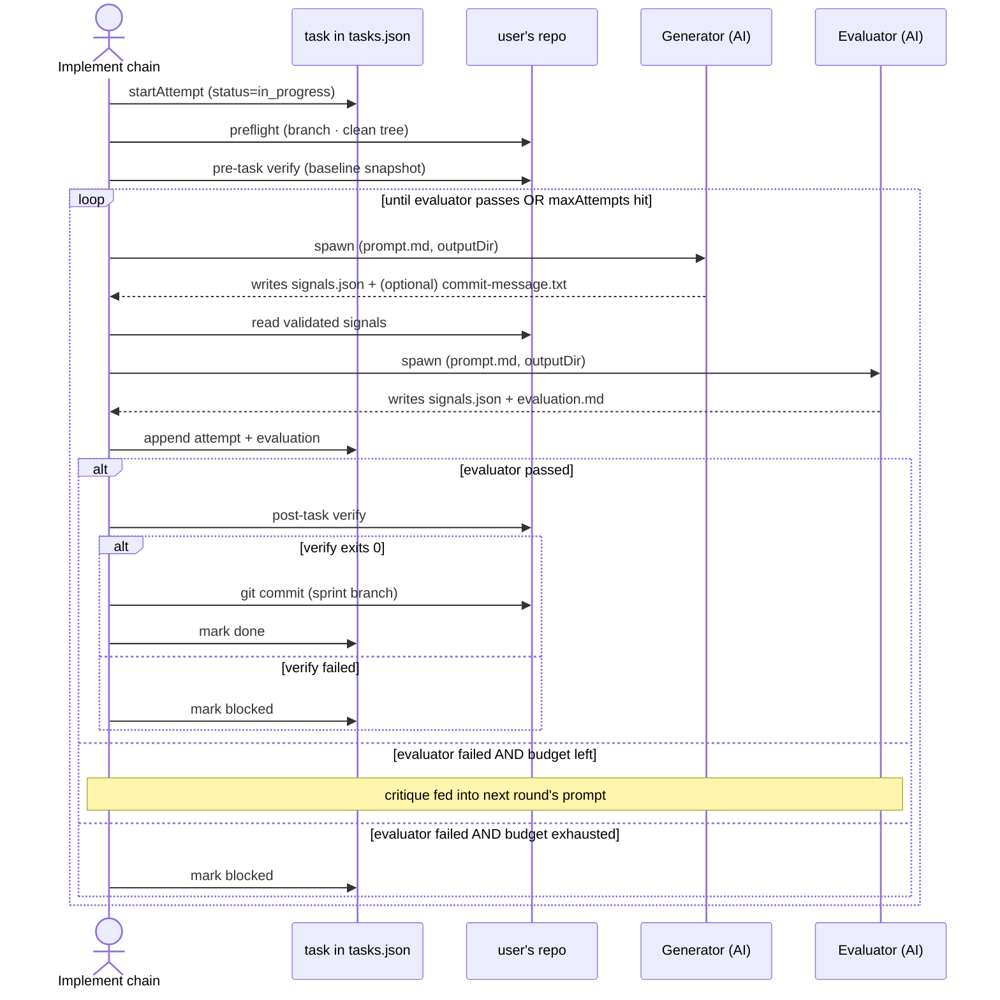

# Task lifecycle

A task moves through `todo → in_progress → (done | blocked)`. The implement flow runs the
per-task subchain that drives every transition. Each task carries `attempts[]` — one entry
per generator-evaluator round inside a single chain run.

## One task, end to end

## Iteration budgets

| Setting                             | Range    | What it bounds                                 |
| ----------------------------------- | -------- | ---------------------------------------------- |
| `settings.harness.maxTurns`         | 1–10     | Generator-evaluator rounds per attempt         |
| `settings.harness.maxAttempts`      | 1–10     | Cap on attempts per task before `blocked`      |
| `settings.harness.rateLimitRetries` | 0–10     | Adapter-side 429 retries (exponential backoff) |
| `task.maxAttempts` (per-task)       | optional | Overrides the global cap for one task          |

All three are mirrored on `IterationConfig` at `src/application/chain/run/iteration-config.ts`.

## Resume-after-crash

Tasks left in `in_progress` from a prior crash reset to `todo` on the next implement launch
(via the `reset-stale-in-progress` leaf at the top of the chain) and re-enter the queue. No
double-execution; the in-flight attempt is dropped from `attempts[]`.

## Backed by

- Entity: `src/domain/entity/task.ts` (with `attempts[]`, `verification`, `evaluation`)
- Repository: `src/domain/repository/task/`
- Mutators: `src/business/task/{create-tasks,update-task,mark-blocked,record-evaluation,reset-stale-in-progress}.ts`
- Per-task leaves: `src/application/flows/implement/leaves/`
- Schema: `src/integration/persistence/task/{task,attempt,evaluation,verification}.schema.ts`
