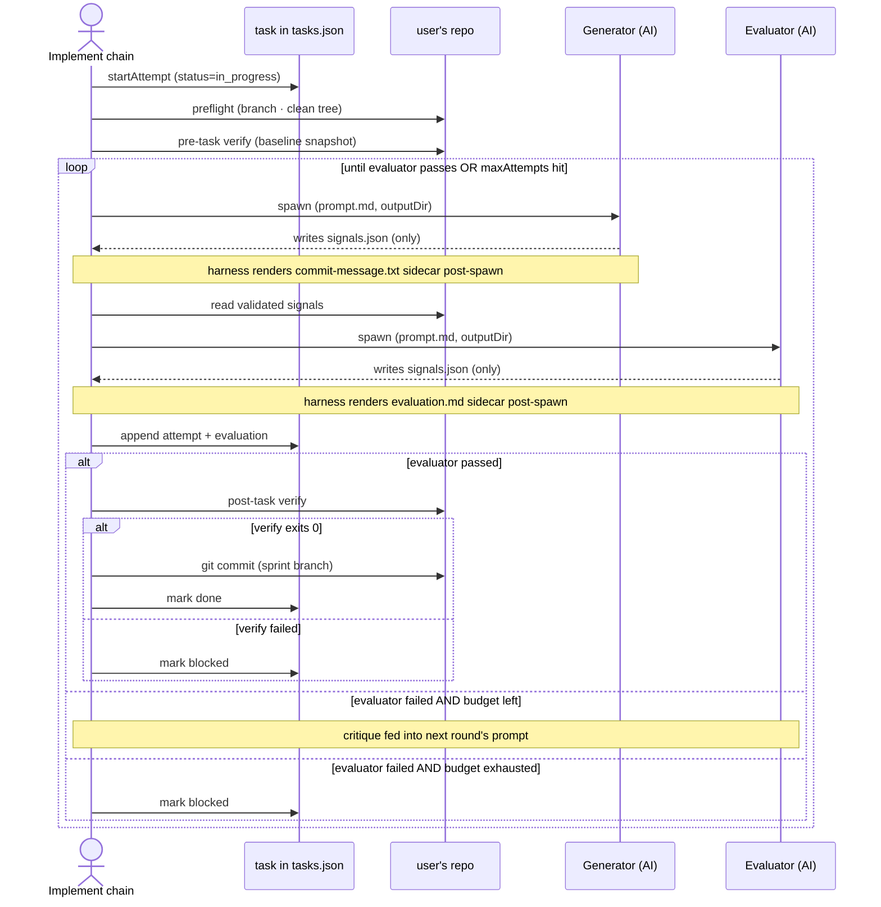

# Task lifecycle

A task moves through `todo → in_progress → (done | blocked)`. The implement flow runs the
per-task subchain that drives every transition. Each task carries an append-only `attempts[]` —
one entry per attempt. A single launch runs up to `maxAttempts` attempts per task (outer loop);
each attempt contains the inner generator-evaluator loop of up to `maxTurns` rounds, which refine
that one attempt's evaluation rather than appending new entries. The array is append-only across
launches, so attempts accumulate within and across chain runs.

## One task, end to end

## Iteration budgets

| Setting                             | Range    | What it bounds                                 |
| ----------------------------------- | -------- | ---------------------------------------------- |
| `settings.harness.maxTurns`         | 1–10     | Generator-evaluator rounds per attempt         |
| `settings.harness.maxAttempts`      | 1–10     | Cap on attempts per task before `blocked`      |
| `settings.harness.rateLimitRetries` | 0–10     | Adapter-side 429 retries (exponential backoff) |
| `task.maxAttempts` (per-task)       | optional | Overrides the global cap for one task          |

All three are mirrored on `IterationConfig` at `src/application/chain/run/iteration-config.ts`.

## Resume-after-crash

A task left `in_progress` from a prior crash (Ctrl+C, SIGTERM, idle-watchdog, OOM — all leave a
leftover `running` attempt) is resumed in place, not reset. On the next implement launch
`resolveImplementQueue` keeps it `in_progress` and sorts it ahead of fresh `todo` work
(in-progress-first stable override). The first `start-attempt` settles the leftover `running`
attempt as `aborted` (cause `process-crash` — the entry is kept in `attempts[]`, never dropped),
then opens a fresh attempt, so there is no double-execution. If settling that aborted attempt
pushes the task over `maxAttempts`, it transitions straight to `blocked`. The only reset-to-`todo`
path is the manual `task unblock` command, not an automatic launch reset.

## Backed by

- Entity: `src/domain/entity/task.ts` (`attempts[]`) and `src/domain/entity/attempt.ts` (each attempt's `verification` / `evaluation`)
- Repository: `src/domain/repository/task/`
- Mutators (use cases): `src/business/task/{start-attempt,settle-attempt,commit-task,unblock-task,cancel-active-task}.ts`
- Domain transitions: `src/domain/entity/{task-lifecycle.ts (markTaskBlocked / unblockTask / resetTaskToTodo), task-settle.ts (markTaskDone / failCurrentAttempt), task-factory.ts (createTask / updateTask)}`
- Per-task leaves: `src/application/flows/implement/leaves/`
- Schema: `src/integration/persistence/task/{task,attempt,evaluation,verification}.schema.ts`
