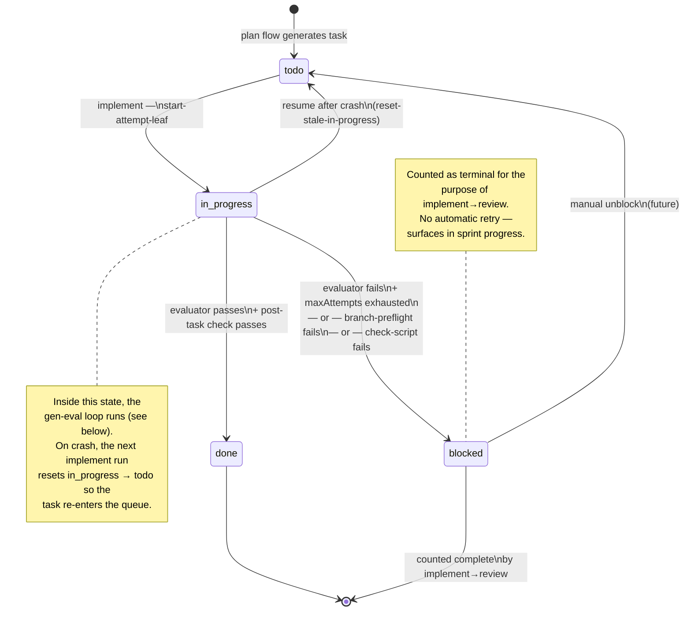
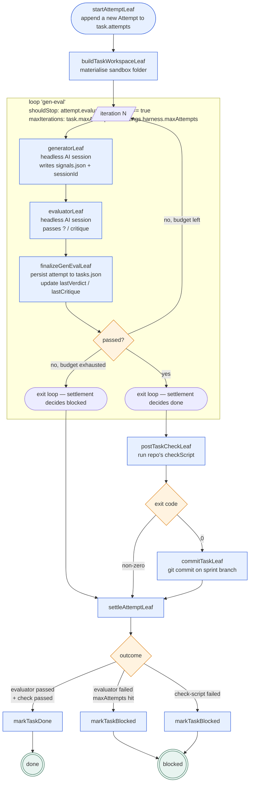

# Task lifecycle

A task moves through four states. The implement flow runs the per-task subchain that drives
the transitions. Each task carries an `attempts[]` history — one entry per
generator-evaluator round inside a single chain run.

## Task states

## Per-task gen-eval loop (inside `in_progress`)

## Iteration budgets

| Setting                             | Range    | What it bounds                                    |
| ----------------------------------- | -------- | ------------------------------------------------- |
| `settings.harness.maxTurns`         | 1–10     | Generator-evaluator turns budgeted per attempt    |
| `settings.harness.maxAttempts`      | 1–10     | Default cap on attempts per task before `blocked` |
| `settings.harness.rateLimitRetries` | 0–10     | Adapter-side 429 retries with exponential backoff |
| `task.maxAttempts` (per-task)       | optional | Overrides the global cap for one task             |

All three are mirrored on `IterationConfig`
(`src/application/chain/run/iteration-config.ts`).

## Resume-after-crash semantics

Tasks left in `in_progress` from a prior crash are reset to `todo` on the next implement
launch (via the `reset-stale-in-progress` leaf at the top of the implement chain) and
re-enter the queue. No double-execution; the in-progress attempt is dropped from the
`attempts[]` history.

## Backed by

- Entity: `src/domain/entity/task.ts` (with `attempts[]`, `verification`, `evaluation`)
- Repository: `src/domain/repository/task/`
- Mutators: `src/business/task/{create-tasks,update-task,mark-blocked,record-evaluation,
reset-stale-in-progress}.ts`
- Per-task leaves: `src/application/flows/implement/leaves/`
- Schema: `src/integration/persistence/task/{task,attempt,evaluation,verification}.schema.ts`
