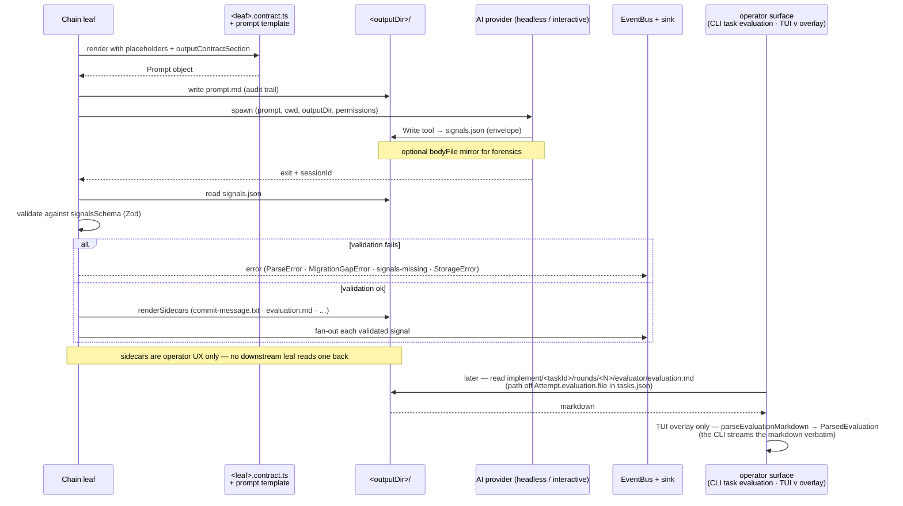

# AI session data flow

Every AI-spawning leaf (refine, plan, ideate, implement-generator/evaluator, readiness,
detect-scripts, detect-skills, apply-feedback, create-pr) follows the same file-based signals contract: the AI
writes one file (`signals.json`), the harness validates + projects.

## What moves between the harness and the AI



## Reading evaluation.md back

`evaluation.md` is the one sidecar with readers. The evaluator contract's sole sidecar rule renders it
via `renderEvaluationMarkdown`, and the leaf stamps its workspace-relative path
(`roundEvaluationRelativePath`) onto `Attempt.evaluation.file` in `tasks.json`. Two operator surfaces
read it back later — `ralphctl task evaluation <taskId>` and the TUI `v` overlay — both resolving the
path through `latestRecordedEvaluation` + `evaluationArtifactSprintPath`. Only the TUI overlay parses
with `parseEvaluationMarkdown`; the CLI streams the artifact byte-for-byte so it can be piped into a
pager or a diff. The round trip is deliberately lossy — per-criterion verdicts are never
rendered, and `applicable: false` collapses onto the literal word `n/a` — pinned by
`tests/integration/ai/contract/evaluation-markdown-roundtrip.test.ts`. No chain leaf reads a sidecar;
downstream leaves take their signals from ctx.

## The wrapper shape on disk

```json
{
  "schemaVersion": 1,
  "signals": [{ "type": "task-complete", "timestamp": "2026-05-23T10:00:00.000Z" }]
}
```

The contract's `migrations[v]` chain walks `fileVersion → schemaVersion` so in-flight sprints
written with an older shape upgrade transparently at read time. A missing migration step
surfaces as `MigrationGapError` — never silent corruption.

## Why one file

Pre-audit, every adapter (claude / copilot / codex) parsed stdout for XML signal tags and
synthesised `signals.json`. That coupled the harness to each CLI's stdout format. The
contract path inverts the responsibility: the AI uses its own `Write` tool to land the file
verbatim; the adapter only mirrors raw body for forensic capture.

## Where each piece lives

| Concern                | Path                                                                                    |
| ---------------------- | --------------------------------------------------------------------------------------- |
| Per-kind Zod schemas   | `src/integration/ai/contract/_engine/signals/<kind>/schema.ts`                          |
| Validation reader      | `src/integration/ai/contract/_engine/validate-signals-file.ts`                          |
| Sidecar renderer       | `src/integration/ai/contract/_engine/render-sidecars.ts`                                |
| Per-leaf contract      | `src/application/flows/<flow>/leaves/<leaf>.contract.ts`                                |
| Prompt section         | `src/integration/ai/contract/_engine/render-contract-section.ts`                        |
| Evaluation renderer    | `src/integration/ai/contract/_engine/render-evaluation-markdown.ts`                     |
| Recorded artifact path | `src/application/flows/implement/leaves/round-artifacts.ts`                             |
| Evaluation parser      | `src/business/task/parse-evaluation-md.ts`                                              |
| Artifact path resolver | `src/business/task/evaluation-artifact.ts`                                              |
| CLI reader surface     | `src/application/ui/cli/commands/task.ts`                                               |
| TUI reader surface     | `src/application/ui/tui/components/evaluation-overlay-internals/use-evaluation-file.ts` |

This contract is implemented under `src/integration/ai/contract/_engine/` (see the table above);
the per-leaf contracts and the read-back surfaces live outside it.
