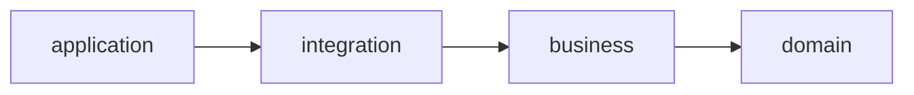

# Architecture

How ralphctl is put together, for someone reading the source for the first time. This is a focused
distillation; the field-by-field internal docs live alongside the code.

## Four layers, one direction

The code is split into four layers. Dependencies point one way only:



| Layer          | What lives there                                                                                                                       |
| -------------- | -------------------------------------------------------------------------------------------------------------------------------------- |
| `domain/`      | Entities, value objects, errors, repository interfaces, the harness-signal types. Pure.                                                |
| `business/`    | Use cases — function factories `(deps) => { execute }`, no classes. Plus the service ports (Logger, EventBus, SCM, version, IO). Pure. |
| `integration/` | Adapters that do I/O: AI providers, prompt/skill loaders, persistence, `gh`/`glab`, file locks.                                        |
| `application/` | Composition root, the chain framework, the flow registry, the runner, and the Ink TUI + CLI.                                           |

`domain/` and `business/` are pure: they cannot import I/O-bearing `node:*` modules (`node:fs`,
`node:child_process`, `node:http`). Only `integration/` does I/O. Only `application/` may import from
anywhere.

This is not a convention you have to trust — it is checked. `eslint.config.ts` carries 15
`no-restricted-imports` rule blocks that fail the build on a wrong-direction import. The same config
bans `class` outside `domain/value/error/`, bans barrel files (`export *`), and keeps each adapter
directory under `integration/ai/<concept>/` isolated from its siblings (shared code goes through an
explicit `_engine/` sub-namespace). A layering violation is a red build, not a review comment.

## The harness kernel

ralphctl runs a coding agent in a loop and verifies each step before moving on. The unit of work is a
**sprint**; a sprint holds **tickets**, and the agent's job is to turn approved tickets into committed code.

The path through the system:

```
ticket  --refine-->  approved ticket  --plan-->  tasks.json (a DAG)  --implement-->  commits + PR
```

- **Refine** flips a ticket from `pending` to `approved` and writes its requirements to disk.
- **Plan** expands the approved tickets into `tasks.json` — a list of tasks with `dependsOn` edges
  (a DAG). The planner is a separate agent from the one that writes code; mixing the two roles degrades
  both.
- **Implement** runs each task through a **generator–evaluator loop**. The generator writes code and
  emits a `signals.json` file. A separate evaluator agent grades that work against the task's criteria
  and the verify-script result. The evaluator defaults to skepticism — an out-of-the-box LLM judge
  approves bad work, so its prompt names concrete failure modes and forces a fail on any floor-dimension
  miss (correctness / completeness / safety / consistency).

Two nested loops drive implement (`src/application/flows/implement/`). The inner loop runs
generator → evaluator turns until the evaluator signals a terminal exit or the `maxTurns` budget is hit.
The outer loop re-runs the whole attempt — including a fresh verify-script baseline — up to
`task.maxAttempts` times until the task settles `done` or `blocked`. On a plateau (consecutive evaluator
rounds flagging the same failures with no improvement) the loop climbs one model rung instead of burning
the rest of the budget on non-productive work.

**Context persists across sessions through files, not memory.** Each agent session starts cold, like a
new engineer on the next shift, and orients itself from disk:

- **Git** is the state backbone. Every settled attempt ends in a commit; the agent reads `git log` at
  session start.
- **`progress.md`** is an append-only journal — one section per settled attempt. It is inlined into the
  next prompt as `<prior_progress>`, so a fresh context window knows what already happened.
- **`signals.json`** is how agents communicate. The agent writes the file with its own Write tool; the
  harness reads it back post-spawn and Zod-validates it. No stdout parsing — that breaks the moment a
  CLI vendor changes its JSON shape.
- A per-project **learnings ledger** (`learnings.ndjson`) accumulates durable insights across sprints.

A **verify script** runs before the agent touches a task (recording a baseline) and again after it
commits. An attribution step compares the two runs, so the harness rejects work that regresses
previously-passing tests but does not punish the agent for failures that were already red.

## The chain framework

Flows are composed from five primitives — an `Element` interface plus four factories under
`src/application/chain/`:

- `leaf` — the only seam to a business use case.
- `sequential` — run children in order; abort the rest on first failure.
- `loop` — the generator-evaluator primitive (`shouldContinue` / `shouldStop` predicates, hard
  `maxIterations` cap).
- `guard` — skip a body unless a predicate holds.

There is deliberately no `retry` or `if/else` primitive: rate-limit retry is an adapter concern, and
branching belongs inside a use case or a `guard`. Every element returns a `Result` and emits a typed
trace entry, so a step-order regression breaks a test. Parallel task execution (`runWaves`) sits _above_
these primitives, never as a sixth one.

## The provider boundary

Claude Code, GitHub Copilot, and Codex sit behind one port: `HeadlessAiProvider.generate(session)`
(`src/integration/ai/providers/_engine/headless-ai-provider.ts`). The caller hands over an `AiSession`
(`.../ai-session.ts`) that describes **intent** — prompt, working directory, model tier, permissions,
the path to write `signals.json`, an optional resume id — and nothing about any specific CLI. Each
adapter under `src/integration/ai/providers/{claude,codex,copilot}/` is the only place that translates
that intent into its CLI's concrete flags and parses its output stream. The composition root picks one
adapter per flow in `src/application/bootstrap/provider-factory.ts`. Adding a fourth provider is a new
adapter directory and one factory case — see [docs/adding-a-provider.md](./docs/adding-a-provider.md).

## Why it's built this way

The four-layer split with enforced dependencies keeps the AI-specific churn — new CLI flags, changed
JSON shapes, new providers — quarantined in `integration/`, where the domain and business rules never
see it. Use cases are plain functions so a flow's dependencies are legible from its signature and tests
construct them without a DI container.

The harness itself follows a single bias: keep the scaffolding minimal and load-bearing. Every component
encodes an assumption about what the model cannot do unaided (the evaluator, the plateau guard, the
verify gate, the idle watchdog that kills a wedged child). Those assumptions go stale as models improve,
so the design favours pieces that can be removed one at a time, with measurement — file-based handoff
over clever in-memory state, separate skeptical evaluator over a self-critical generator, context resets
over compaction. The structure exists to make that ongoing subtraction safe.

---

_Referenced from the [README](./README.md). For the chain-primitive contract and the full harness-design
principle list, read the source under `src/application/chain/` and `src/application/flows/`._
