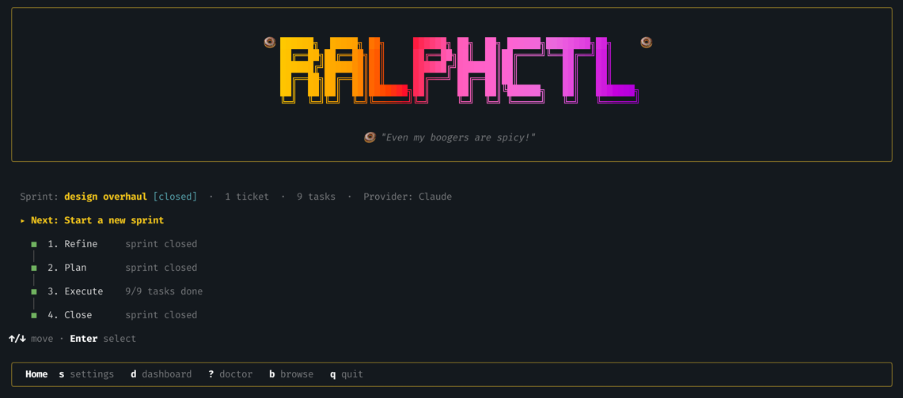

[](https://www.npmjs.com/package/ralphctl)
[](https://www.npmjs.com/package/ralphctl)
[](https://github.com/lukas-grigis/ralphctl/actions/workflows/ci.yml)
[](./LICENSE)
[](https://www.typescriptlang.org/)
[](https://nodejs.org/)
[](./CONTRIBUTING.md)
[](https://docs.anthropic.com/en/docs/claude-code)
[](https://docs.github.com/en/copilot/github-copilot-in-the-cli)

<p align="center">
  
</p>

**Agent harness for long-running AI coding tasks —
orchestrates [Claude Code](https://docs.anthropic.com/en/docs/claude-code) & [GitHub Copilot](https://docs.github.com/en/copilot/github-copilot-in-the-cli)
across repositories.**

> _"I'm helping!"_ — Ralph Wiggum

> [!NOTE]
> **Active development** — new features and polish ship regularly. Setup is quick, so upgrading is low-friction. See
> [CHANGELOG](./CHANGELOG.md).

---

## Why ralphctl?

AI coding agents are powerful but lose context on long tasks, need babysitting when things break, and have no way to
coordinate changes across multiple repositories. RalphCTL decomposes your work into dependency-ordered tasks, runs each
one through a [generator-evaluator loop](https://www.anthropic.com/engineering/harness-design-long-running-apps) that
catches issues before moving on, and persists context across sessions so nothing gets lost. You describe what to build —
ralphctl handles the rest.

---

## How It Works

```
  You describe what to build           ralphctl handles the rest
  ─────────────────────────           ─────────────────────────────────
  ┌──────────┐   ┌──────────┐        ┌────────┐   ┌──────┐   ┌─────────┐
  │  Create  │──>│   Add    │───────>│ Refine │──>│ Plan │──>│ Execute │
  │  Sprint  │   │ Tickets  │        │ (WHAT) │   │(HOW) │   │  Loop   │
  └──────────┘   └──────────┘        └────────┘   └──────┘   └─────────┘
                                          │            │           │
                                     AI clarifies  AI generates  AI implements
                                     requirements  task graph    + AI reviews
                                     with you      from specs    each task
```

- **Dependency-ordered execution** — tasks run in the right sequence, one per repo at a time, with parallel execution
  where possible
- **Generator-evaluator cycle** — an independent AI reviewer checks each task against its spec; if it fails, the
  generator gets feedback and iterates
- **Context persistence** — sprint state, progress history, and task context survive across sessions; interrupted work
  resumes where it left off

---

## Quick Start

```bash
npm install -g ralphctl
ralphctl
```

That's it. Launches the interactive TUI — walks you through project setup, ticket refinement, task planning, and
execution. No commands to memorize.

Requires [Node.js](https://nodejs.org/) >= 24, [Git](https://git-scm.com/), and
either [Claude CLI](https://docs.anthropic.com/en/docs/claude-code)
or [GitHub Copilot CLI](https://docs.github.com/en/copilot/github-copilot-in-the-cli) installed and authenticated.

<details>
<summary>Prefer explicit commands?</summary>

```bash
# 1. Register a project (points to your repo)
ralphctl project add

# 2. Create a sprint
ralphctl sprint create --name "my-first-sprint"

# 3. Add a ticket
ralphctl ticket add --project my-app --title "Add user authentication"

# 4. Let AI refine requirements, plan tasks, and execute
ralphctl sprint refine
ralphctl sprint plan
ralphctl sprint start
```

</details>

---

## Features

- **Break big tickets into small tasks** — dependency-ordered so they execute in the right sequence
- **Catch mistakes before they compound** — independent AI review after each task, iterating until quality passes or
  budget is exhausted
- **Coordinate across repositories** — one sprint can span multiple repos with automatic dependency tracking
- **Branch per sprint** — optional shared branch across every affected repo, with `sprint close --create-pr` to open
  pull requests when you're done
- **Run tasks in parallel** — one per repo, with rate-limit backoff and automatic session resume
- **Separate the what from the how** — AI clarifies requirements first, then generates implementation tasks, with human
  approval gates
- **Pick up where you left off** — full state persistence across sessions; interrupted work resumes automatically
- **Pair or let it run** — work alongside your AI agent interactively, or let it execute unattended
- **Zero-memorization start** — run `ralphctl` with no args for a guided menu

---

## Configuration

RalphCTL supports **Claude Code** and **GitHub Copilot** as AI backends.

```bash
ralphctl config set provider claude      # Use Claude Code
ralphctl config set provider copilot     # Use GitHub Copilot
```

Auto-prompts on first AI command if not set. Both CLIs must be in your PATH and authenticated.

Tune the generator-evaluator loop:

```bash
ralphctl config set evaluationIterations 2   # Up to 2 fix attempts per task (default: 1)
ralphctl config set evaluationIterations 0   # Disable evaluation entirely
```

`sprint start --no-evaluate` skips evaluation for a single run without touching the global setting.

<details>
<summary>Provider differences</summary>

| Feature                     | Claude Code                          | GitHub Copilot                                                       |
| --------------------------- | ------------------------------------ | -------------------------------------------------------------------- |
| Status                      | GA                                   | Public preview                                                       |
| Headless execution          | `-p --output-format json`            | `-p --output-format json --autopilot --no-ask-user`                  |
| Session IDs                 | In JSON output (`session_id`)        | In JSON output (`session_id`), `--share` file as fallback            |
| Session resume (`--resume`) | Full support                         | Full support                                                         |
| Per-tool permissions        | Settings files + `--permission-mode` | `--allow-all-tools` (all-or-nothing by default)                      |
| Fine-grained tool control   | `allow`/`deny` in settings files     | `--allow-tool`, `--deny-tool` flags (not yet used)                   |
| Rate limit detection        | Validated patterns                   | Borrowed from Claude — not yet validated against real Copilot errors |

</details>

---

## Data Directory

All data lives in `~/.ralphctl/` by default. Override with:

```bash
export RALPHCTL_ROOT="/path/to/custom/data-dir"
```

---

<details>
<summary><strong>CLI Command Reference</strong></summary>

### Getting Started

| Command                                          | Description                         |
| ------------------------------------------------ | ----------------------------------- |
| `ralphctl`                                       | Interactive menu mode (recommended) |
| `ralphctl doctor`                                | Check environment health            |
| `ralphctl config set provider <claude\|copilot>` | Set AI provider                     |
| `ralphctl config show`                           | Show current configuration          |
| `ralphctl completion install`                    | Enable shell tab-completion         |

### Project & Sprint Setup

| Command                  | Description                      |
| ------------------------ | -------------------------------- |
| `ralphctl project add`   | Register a project and its repos |
| `ralphctl sprint create` | Create a new sprint (draft)      |
| `ralphctl sprint list`   | List all sprints                 |
| `ralphctl sprint show`   | Show current sprint details      |
| `ralphctl sprint switch` | Quick sprint switcher            |
| `ralphctl ticket add`    | Add a work item to a sprint      |

### AI-Assisted Planning

| Command                        | Description                             |
| ------------------------------ | --------------------------------------- |
| `ralphctl sprint refine`       | Clarify requirements with AI (WHAT)     |
| `ralphctl sprint plan`         | Generate tasks from requirements (HOW)  |
| `ralphctl sprint ideate`       | Quick single-session refine + plan      |
| `ralphctl sprint requirements` | Export refined requirements to markdown |

### Execution & Monitoring

| Command                    | Description                                            |
| -------------------------- | ------------------------------------------------------ |
| `ralphctl sprint start`    | Execute tasks with AI (`--branch` for a sprint branch) |
| `ralphctl sprint health`   | Diagnose blockers and stale tasks                      |
| `ralphctl sprint insights` | Analyze evaluator results across tasks                 |
| `ralphctl status`          | Sprint overview with progress bar                      |
| `ralphctl task list`       | List tasks in the current sprint                       |
| `ralphctl task next`       | Show the next unblocked task                           |
| `ralphctl sprint close`    | Close an active sprint (`--create-pr` for PRs)         |
| `ralphctl sprint delete`   | Delete a sprint permanently                            |

Run `ralphctl <command> --help` for details on any command.

</details>

---

## Documentation

| Resource                                       | Description                                |
| ---------------------------------------------- | ------------------------------------------ |
| [Architecture](./.claude/docs/ARCHITECTURE.md) | Data models, file storage, error reference |
| [Requirements](./.claude/docs/REQUIREMENTS.md) | Acceptance criteria and feature checklist  |
| [Contributing](./CONTRIBUTING.md)              | Dev setup, code style, PR process          |
| [Changelog](./CHANGELOG.md)                    | Version history                            |

**Blog posts:** [Building ralphctl](https://lukasgrigis.dev/blog/building-ralphctl) (backstory) | [From task CLI to agent harness](https://lukasgrigis.dev/blog/ralphctl-agent-harness/) (evaluator deep-dive)

**Further reading:** [Harness Engineering for Coding Agent Users](https://martinfowler.com/articles/harness-engineering.html) — Martin Fowler (April 2026) | [Harness Design for Long-Running Application Development](https://www.anthropic.com/engineering/harness-design-long-running-apps) — Anthropic Engineering

---

## Development

```bash
git clone https://github.com/lukas-grigis/ralphctl.git
cd ralphctl
pnpm install
pnpm dev --help          # Run CLI in dev mode (tsx, no build needed)
pnpm build               # Compile for npm distribution (tsup)
pnpm typecheck           # Type check
pnpm test                # Run tests
pnpm lint                # Lint
```

---

## Contributing

Contributions are welcome! Please **open an issue first** to discuss what you'd like to change.

See [CONTRIBUTING.md](./CONTRIBUTING.md) for the full guide — dev setup, code style, PR process, and releasing.

This project follows the [Contributor Covenant](./CODE_OF_CONDUCT.md) code of conduct.

---

## Security

To report a vulnerability,
use [GitHub's private reporting](https://github.com/lukas-grigis/ralphctl/security/advisories/new).
See [SECURITY.md](./SECURITY.md) for details.

---

## License

MIT — see [LICENSE](./LICENSE) for details.
