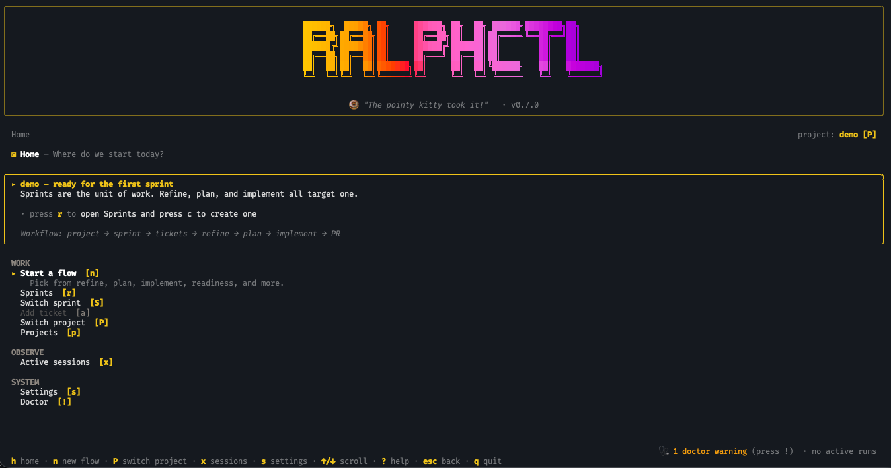
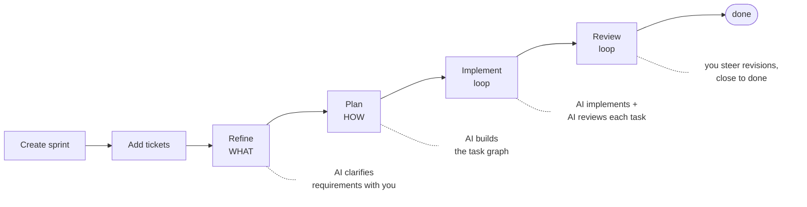
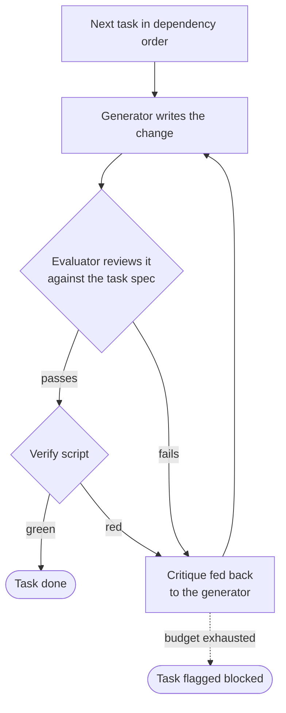

[](https://www.npmjs.com/package/ralphctl)
[](https://www.npmjs.com/package/ralphctl)
[](https://github.com/lukas-grigis/ralphctl/actions/workflows/ci.yml)
[](./LICENSE)
[](https://www.typescriptlang.org/)
[](https://nodejs.org/)
[](./CONTRIBUTING.md)
[](https://docs.anthropic.com/en/docs/claude-code)
[](https://docs.github.com/en/copilot/github-copilot-in-the-cli)
[](https://github.com/openai/codex)
[](https://opencode.ai/)
[](https://github.com/lukas-grigis/ralphctl)

<p align="center">
  
</p>

# ralphctl

**A ralph harness for long-running AI coding tasks — a hardened ralph loop that drives your coding agent of choice
([Claude Code](https://docs.anthropic.com/en/docs/claude-code),
[GitHub Copilot CLI](https://docs.github.com/en/copilot/github-copilot-in-the-cli),
[OpenAI Codex CLI](https://github.com/openai/codex), or [OpenCode](https://opencode.ai/)) across one or more
repositories.**

> _"I'm helping!"_ — Ralph Wiggum

> [!TIP]
> **New: [OpenCode](#opencode) support (beta) — run ralphctl on whatever model you want.** OpenCode is a
> vendor-neutral CLI that fronts 75+ providers and local runtimes, so adding it effectively opens the harness
> to Anthropic, OpenAI, Google, Bedrock, Azure, OpenRouter, Groq, DeepSeek, Mistral, and local Ollama /
> LM Studio / llama.cpp — with your own keys, or none at all.
>
> ```bash
> npm install -g ralphctl opencode-ai
> ralphctl settings set ai.implement.generator.provider opencode
> ralphctl settings set ai.implement.generator.model    <provider>/<model>
> ```

> [!NOTE]
> **Active development.** New features and polish ship regularly. Four backends are supported — Claude Code,
> GitHub Copilot CLI, OpenAI Codex CLI, and OpenCode (beta), the last of which brings any model it can reach.
> Pick one per flow or mix them, in one command, from 21 presets across five families (`standard`, `economic`,
> `strong-gate`, `fast`, `frontier`), each in `mixed` / `claude-only` / `copilot-only` / `codex-only`
> variants, plus a standalone `opencode-only`.
> Upgrades are best-effort: install the latest version, redo your config, proceed.
> See [Upgrading](#upgrading) and [CHANGELOG](./CHANGELOG.md).

---

## What is a ralph harness?

The "Ralph" technique comes from Geoffrey Huntley's [Ralph Wiggum as a software engineer](https://ghuntley.com/ralph/):
point a coding agent at a task and run it in a loop until the work is done. The bare version
(`while :; do cat PROMPT.md | claude; done`) loops blindly — it re-runs the same prompt and hopes each pass lands.
ralphctl is a ralph harness around that idea: instead of blind repetition it runs a generator-evaluator loop, where one
pass writes the change and a second independent pass reviews it against the task spec before the loop advances. Same
loop, with a verification gate on every step. For the wider picture — what an agent harness is, and how the
plan → generate → evaluate → verify loop turns one-shot prompting into a repeatable workflow — see
[AI Agent Harnesses: A Field Guide](https://lukasgrigis.dev/blog/guides/agent-harnesses/).

---

## What is ralphctl?

AI coding agents are powerful but lose context on long tasks, need babysitting when things break, and have no way to
coordinate changes across multiple repositories. ralphctl wraps your chosen AI CLI — Claude Code, GitHub Copilot CLI,
OpenAI Codex CLI, or OpenCode — in a
structured harness that decomposes your work into dependency-ordered tasks, drives each one through
a [generator-evaluator loop](https://www.anthropic.com/engineering/harness-design-long-running-apps) that catches issues
before moving on, and persists context across sessions so nothing gets lost.

You describe what to build. ralphctl handles the rest — or works alongside you, whichever you prefer.

---

## Quick Start

```bash
npm install -g ralphctl
```

> Needs [Node.js](https://nodejs.org/) ≥ 24 — `mise use node@24` or `nvm install 24`.

Install one of the supported CLIs and authenticate it:

| CLI                                                                                | Install                              | Auth                  |
| ---------------------------------------------------------------------------------- | ------------------------------------ | --------------------- |
| [Claude Code](https://docs.anthropic.com/en/docs/claude-code)                      | `npm i -g @anthropic-ai/claude-code` | Anthropic account     |
| [GitHub Copilot CLI](https://docs.github.com/en/copilot/github-copilot-in-the-cli) | `npm i -g @github/copilot`           | GitHub Copilot seat   |
| [OpenAI Codex CLI](https://github.com/openai/codex)                                | `npm i -g @openai/codex`             | ChatGPT / OpenAI      |
| [OpenCode](https://opencode.ai/) — beta                                            | `npm i -g opencode-ai`               | your own key, or none |

Then confirm ralphctl can see it:

```bash
ralphctl doctor    # verifies your provider CLI is installed + authenticated — the #1 first-run failure
```

When `doctor` is green, launch:

```bash
ralphctl
```

That's it. The TUI launches, walks you through registering a project, refining your first ticket, generating a task
plan, and kicking off implementation. Press `+` from the home screen to create a new sprint, press `n` to start a
flow (refine / plan / implement / readiness / …), or open the Sprints submenu and follow its on-screen hint to pick
or create a sprint. No commands to memorize.

**Requirements:** [Node.js](https://nodejs.org/) ≥ 24, [Git](https://git-scm.com/), and one supported AI CLI in `PATH`
and authenticated (OpenCode takes your own keys, or runs on its free tier with none).

<details>
<summary>Prefer the CLI for inspection + one-shot operations?</summary>

Interactive flows (refine / plan / ideate / implement / readiness / create sprint) are TUI-only. The CLI covers
inspection and one-shot operations:

```bash
# Inspect projects + sprints
ralphctl project list
ralphctl sprint list
ralphctl sprint show <sprint-id>
ralphctl sprint progress <sprint-id>

# Add / inspect tickets
ralphctl ticket add --title "<title>"
ralphctl ticket list

# Manage sprint state
ralphctl sprint activate <sprint-id>
ralphctl sprint close <sprint-id>           # review → done
ralphctl sprint remove <sprint-id>

# Open a PR for the sprint branch
ralphctl create-pr --sprint <sprint-id>

# Export sprint artifacts
ralphctl export-requirements --sprint <id> --output <path>
ralphctl export-context --sprint <id> --project <id> --output <path>

# Settings
ralphctl settings show
ralphctl settings apply-preset claude-only     # or mixed / copilot-only / codex-only / opencode-only / *-economic / *-strong-gate / *-fast / *-frontier
ralphctl settings set ai.implement.generator.provider claude-code
ralphctl settings set ai.implement.generator.model    <model-id>
ralphctl settings set ai.implement.generator.effort   high
ralphctl settings set ai.implement.evaluator.provider openai-codex
ralphctl settings set ai.implement.evaluator.model    <model-id>
```

</details>

---

## How It Works


```mermaid
flowchart LR
    A[Create sprint] --> B[Add tickets]
    B --> C[Refine<br>WHAT]
    C --> D[Plan<br>HOW]
    D --> E[Implement<br>loop]
    E --> F[Review<br>loop]
    F --> G([done])

    C -.- c1[AI clarifies<br>requirements with you]
    D -.- d1[AI builds<br>the task graph]
    E -.- e1[AI implements +<br>AI reviews each task]
    F -.- f1[you steer revisions,<br>close to done]

    classDef note fill:none,stroke:none
    class c1,d1,e1,f1 note
```

The first two steps are yours; from **Refine** onward ralphctl drives, with approval gates where your judgement
matters.

**Refine** is implementation-agnostic: the AI clarifies requirements with you, ticket by ticket, and flips each one from
`pending` to `approved`. **Plan** requires every ticket approved — the AI explores the affected repos and generates a
dependency-ordered task graph. **Implement** drives those tasks in dependency order through a generator-evaluator cycle:
a second AI pass reviews each task against its spec before the harness marks it done and moves on. Independent tasks in
the same dependency wave can run in parallel (opt-in) when you want a sprint to finish faster. **Review** closes the
loop — once every task lands, the sprint enters `review` and you run human-steered feedback rounds: you flag what's off,
the AI revises, and the sprint flips to `done` when you're satisfied. Opening a PR (`ralphctl create-pr`) is separate
and optional.

The loop inside **Implement** is what separates a ralph harness from a bare `while` loop — every task passes an
independent reviewer before the harness moves on:


```mermaid
flowchart TB
    T[Next task in dependency order] --> G[Generator writes the change]
    G --> E{Evaluator reviews it<br>against the task spec}
    E -->|passes| V{Verify script}
    E -->|fails| C[Critique fed back<br>to the generator]
    C --> G
    V -->|green| D([Task done])
    V -->|red| C
    C -.->|budget exhausted| B([Task flagged blocked])
```

Key properties:

- **Dependency-ordered execution** — tasks run in topological order; no task starts until its blockers are done.
  Opt-in parallelism (`concurrency.maxParallelTasks` > 1) runs independent tasks within a dependency wave concurrently,
  each in its own git worktree folded onto one branch — default stays serial
- **Generator-evaluator cycle** — an independent AI reviewer checks each task; if it fails, the generator gets the
  critique and iterates (up to `harness.maxAttempts` tries before the task is flagged `blocked`)
- **Context persistence** — sprint state, branch, progress history, and per-task context survive across sessions;
  interrupted runs resume automatically
- **Multi-repo support** — one sprint can span several repositories with per-repo setup and verify scripts

For the full architectural picture see [`.claude/docs/ARCHITECTURE.md`](./.claude/docs/ARCHITECTURE.md) and [
`.claude/docs/REQUIREMENTS.md`](./.claude/docs/REQUIREMENTS.md).

---

## Providers

ralphctl drives four AI coding CLIs. Choose one per flow — or mix them, say plan with one and implement with
another — through a [preset](#configuration) or per-row settings. Three bind you to a vendor;
[OpenCode](#opencode) fronts 75+ providers and local runtimes, so between them the harness reaches essentially
any model you can get an API key for.

| Provider                                  | CLI        | Status | Auth to get started | Headless permission mapping                                                                     | Native context file               |
| ----------------------------------------- | ---------- | ------ | ------------------- | ----------------------------------------------------------------------------------------------- | --------------------------------- |
| **Claude Code** (`claude-code`)           | `claude`   | Stable | Anthropic account   | `--permission-mode bypassPermissions` + per-tool deny list                                      | `CLAUDE.md` at repo root          |
| **GitHub Copilot CLI** (`github-copilot`) | `copilot`  | Stable | GitHub Copilot seat | `--autopilot --max-autopilot-continues=200` + `--allow-all` (per-tool deny list when read-only) | `.github/copilot-instructions.md` |
| **OpenAI Codex CLI** (`openai-codex`)     | `codex`    | Stable | ChatGPT / OpenAI    | `-s workspace-write` (topology-scoped)                                                          | `AGENTS.md`                       |
| **OpenCode** (`opencode`)                 | `opencode` | Beta   | any (or none)       | `--auto` (topology-scoped)                                                                      | `AGENTS.md`                       |

Claude Code has the most end-to-end mileage inside the harness — it's the most battle-tested — but Copilot and Codex
run every flow and are supported first-class. Two small differences worth knowing: bundled skill injection and
`bodyFile` forensic artifacts currently no-op on Copilot and Codex, and Codex's sandbox has only two modes
(read-only / workspace-write), so path scope (cwd + `--add-dir`) is its fine-grained safety envelope rather than a
per-tool deny list. Parallel execution is provider-agnostic — it works with whichever provider each implement role is
configured to use. Hit a rough edge with any provider? Please [open an
issue](https://github.com/lukas-grigis/ralphctl/issues).

<a id="opencode"></a>

### OpenCode (beta) — bring any model

The first three backends each bind you to one vendor. [OpenCode](https://opencode.ai/) doesn't: it is a
vendor-neutral CLI that fronts **75+ model providers** (via [Models.dev](https://models.dev/)) plus local
runtimes, on a bring-your-own-key model. Adding it to ralphctl means the harness is no longer limited to the
three vendors it ships adapters for.

| Want to run…               | With OpenCode                                                   |
| -------------------------- | --------------------------------------------------------------- |
| A frontier hosted model    | Anthropic, OpenAI, Google Vertex, Bedrock, Azure — your own key |
| An aggregator              | OpenRouter, Together, Groq, Hugging Face                        |
| A specialist or open model | DeepSeek, Mistral, xAI, and the rest of the Models.dev catalog  |
| Something entirely local   | Ollama, LM Studio, llama.cpp — no data leaves your machine      |
| Nothing at all set up yet  | OpenCode's own free tier — no account, no key                   |

```bash
npm install -g opencode-ai
opencode providers                  # connect Anthropic / OpenAI / Ollama / … with your own keys
opencode models                     # list every id now reachable

ralphctl settings set ai.implement.generator.provider opencode
ralphctl settings set ai.implement.generator.model    <provider>/<model>
```

Model ids are namespaced `<provider>/<model>`, and ralphctl asks the CLI (`opencode models`) rather than
shipping a fixed list — so connecting a new provider in OpenCode makes its models selectable in ralphctl
immediately, with no ralphctl upgrade and no catalog PR. That is the practical difference: **new models become
usable the day they land upstream.**

Mix freely — nothing forces a whole sprint onto one backend. A local model can draft while a frontier model
reviews:

```bash
ralphctl settings set ai.implement.generator.provider opencode
ralphctl settings set ai.implement.generator.model    ollama/<your-local-model>
ralphctl settings set ai.implement.evaluator.provider claude-code
ralphctl settings set ai.implement.evaluator.model    claude-opus-5
```

There is also a zero-auth path if you just want to see the harness run: `ralphctl settings apply-preset
opencode-only` uses OpenCode's free tier, which needs no credentials at all. Handy for a first look or a CI
job without secrets — the free-tier models are community models, so point OpenCode at a real provider before
judging output quality.

**Why beta.** Every flow runs and the adapter is verified end-to-end against the real CLI, but it has far less
mileage than the other three — please [report anything rough](https://github.com/lukas-grigis/ralphctl/issues).
Two current limitations, stated plainly: `opencode run` has no read-only mode, so a read-only flow is not
sandboxed by the CLI (the session directory is the boundary, as it already is for OpenAI Codex), and it has no
multi-root flag, so directories outside the session `cwd` are not reachable by the AI. Plateau escalation also
skips the effort rung for OpenCode, because the accepted `--variant` levels belong to whichever upstream vendor
is behind your model id — set `effort` explicitly on the row if your model supports it.

One-shot configuration for any provider: `ralphctl settings apply-preset <name>` where `<name>` is one of
21 presets — `standard`, `economic`, `strong-gate`, `fast`, and `frontier` families, each in
`mixed` / `claude-only` / `copilot-only` / `codex-only` variants, plus `opencode-only`.

---

## Features

- **Break big tickets into small tasks** — dependency-ordered so they execute in the right sequence
- **Catch mistakes before they compound** — independent AI review after each task, iterating until quality passes or
  budget is exhausted
- **Coordinate across repositories** — one sprint can span multiple repos with automatic dependency tracking
- **Finish sprints faster (opt-in)** — run independent tasks within a dependency wave in parallel, each in its own git
  worktree, folded back onto one sprint branch (still one PR); default stays serial, zero change
- **Branch per sprint** — optional shared branch across every affected repo; `ralphctl create-pr --sprint <id>` opens a
  PR / MR via `gh` or `glab` when you're done
- **Recover from rate limits** — exponential backoff and session resume keep the in-flight task's full context when the
  provider restarts
- **Separate the what from the how** — AI clarifies requirements first (Refine), then generates the implementation
  plan (Plan), with human approval gates between
- **Pick up where you left off** — full state persistence; interrupted Implement runs resume in-progress tasks
  first — the crashed attempt is settled as aborted (kept in history) and a fresh attempt opens automatically
- **Pair or let it run** — work alongside your AI agent interactively, or let it execute unattended
- **Zero-memorization start** — run `ralphctl` with no args for a guided menu
- **Run any model** — the OpenCode backend (beta) fronts 75+ providers and local runtimes (Ollama, LM Studio,
  llama.cpp), so the harness isn't limited to the three vendors it ships adapters for — and its free tier lets you
  try the whole loop with no account at all

---

## Configuration

Configure via the TUI `Settings` view or one-shot CLI commands.

**Quickest path — apply a preset.** Presets auto-seed from your detected CLIs on first run; override later with
`apply-preset`.

<details>
<summary>All 21 presets</summary>

```bash
# Standard — flagship model per flow
ralphctl settings apply-preset mixed               # best-fit provider per flow
ralphctl settings apply-preset claude-only         # every flow on Claude Code
ralphctl settings apply-preset copilot-only        # every flow on GitHub Copilot CLI
ralphctl settings apply-preset codex-only          # every flow on OpenAI Codex CLI
ralphctl settings apply-preset opencode-only       # every flow on OpenCode's free tier (no auth)

# Economic — implement starts one tier below flagship; escalation ladder climbs only on plateau
ralphctl settings apply-preset mixed-economic
ralphctl settings apply-preset claude-economic
ralphctl settings apply-preset copilot-economic
ralphctl settings apply-preset codex-economic

# Strong-gate — cheap generator, permanently-flagship evaluator gate
ralphctl settings apply-preset mixed-strong-gate
ralphctl settings apply-preset claude-strong-gate
ralphctl settings apply-preset copilot-strong-gate
ralphctl settings apply-preset codex-strong-gate

# Fast — cheapest viable tier at low effort; plateau settles rather than escalating (escalateOnPlateau=false)
ralphctl settings apply-preset mixed-fast
ralphctl settings apply-preset claude-fast
ralphctl settings apply-preset copilot-fast
ralphctl settings apply-preset codex-fast

# Frontier — flagship everywhere at max effort
ralphctl settings apply-preset mixed-frontier
ralphctl settings apply-preset claude-frontier
ralphctl settings apply-preset copilot-frontier
ralphctl settings apply-preset codex-frontier
```

Twenty-one presets ship, all equally first-class — none is marked default. `opencode-only` sits outside the
five-family grid on purpose: every free-tier model is at the same (zero) price point, so `economic` / `frontier`
variants of it would differ in name only. Applying a
preset stamps the entire `ai` section plus `harness.escalateOnPlateau` in one transaction (`fast` stamps it
`false` so a plateau settles; all others stamp it `true`). On a fresh install the welcome view silently
auto-seeds a preset based on which provider CLIs it detects on `PATH`.

</details>

**Per-flow settings.** Each flow carries its own `{provider, model, effort?}` row: `refine`, `plan`, `readiness`,
`ideate`, and `createPr`. The `implement` flow instead splits into a nested `generator` / `evaluator` pair
(`ai.implement.generator.*` and `ai.implement.evaluator.*`), each its own `{provider, model, effort?}` row. Edit
individual keys with:

```bash
ralphctl settings set ai.implement.generator.provider claude-code
ralphctl settings set ai.implement.generator.model    <model-id>
ralphctl settings set ai.implement.generator.effort   high

ralphctl settings set ai.plan.provider      github-copilot
ralphctl settings set ai.plan.model         <model-id>
```

The selected provider's CLI must be in your `PATH` and authenticated. Every AI-spawning flow probes its
row's CLI at launch and exits with a clear error if the binary is missing.

**Tune the generator-evaluator loop** (under `harness`):

```bash
ralphctl settings set harness.maxAttempts 2          # Cap fix attempts per task (1–10, default 3)
ralphctl settings set harness.maxTurns    8          # Generator-evaluator turns per attempt (1–10)
ralphctl settings set harness.rateLimitRetries 3     # Adapter-side 429 retries (0–10)
```

**Run tasks in parallel** (optional — default is serial):

```bash
ralphctl settings set concurrency.maxParallelTasks 3   # 1–5; 1 = serial (default), >1 = parallel git worktrees
```

When `> 1`, independent tasks within a dependency wave run concurrently — each in its own git worktree, with its own
`setupScript` run, folded back onto the single sprint branch (still one PR per sprint). A task whose worktree setup
fails is blocked on its own without stopping its siblings; if two same-wave tasks edit the same file, the second is
blocked at fold time and a relaunch retries it. Dependencies are always respected — only independent tasks overlap.

### Data directory

All state lives in `~/.ralphctl/` by default (settings under `config/`, sprints + projects under `data/`, advisory locks
under `state/`). Override the root with:

```bash
export RALPHCTL_HOME="/path/to/custom/dir"
```

### Environment variables

| Variable                     | Default        | Purpose                                              |
| ---------------------------- | -------------- | ---------------------------------------------------- |
| `RALPHCTL_HOME`              | `~/.ralphctl/` | Override application root (data + config + state)    |
| `RALPHCTL_SKIP_LEGACY_CHECK` | unset          | Bypass the v0.6.x legacy-layout detector at boot     |
| `RALPHCTL_NO_TUI`            | unset          | Suppress implicit interactive prompts in `implement` |
| `NO_COLOR`                   | unset          | Suppress ANSI colors                                 |
| `CI`                         | auto-detected  | Suppress implicit interactive prompts in `implement` |

Log verbosity is `settings.logging.level` (`silent` / `debug` / `info` / `warn` / `error`, default `info`), set via
`ralphctl settings set logging.level <level>` or the TUI `Settings` view — not an environment variable.

---

## Upgrading

Install the latest version, redo your config, proceed. Only the latest
release is supported — there's no backporting, and upgrading is the answer
to most "is this fixed?" questions.

```bash
npm install -g ralphctl@latest
ralphctl settings apply-preset <name>    # if your settings need a reset
ralphctl                                  # TUI prompts you to re-register projects if needed
```

If your `~/.ralphctl/` data from an older release doesn't load cleanly, back
it up and start fresh:

```bash
mv ~/.ralphctl ~/.ralphctl.bak
```

The backup keeps your ticket bodies, plan output, and progress notes around
for reference. See [MIGRATION.md](./MIGRATION.md) if you're crossing a major
boundary (e.g. 0.6.x → 0.7.x) and want the longer story.

---

<details>
<summary><strong>CLI Command Reference</strong></summary>

The CLI surface is deliberately smaller than v0.6.x — interactive flows (refine / plan / ideate / implement /
readiness / create sprint) stay TUI-only by design. The CLI exposes inspection + one-shot operations.

### Getting Started

| Command                                 | Description                                                                                                                                                                   |
| --------------------------------------- | ----------------------------------------------------------------------------------------------------------------------------------------------------------------------------- |
| `ralphctl`                              | Interactive TUI (primary surface)                                                                                                                                             |
| `ralphctl doctor`                       | Check environment health                                                                                                                                                      |
| `ralphctl settings show`                | Print current settings                                                                                                                                                        |
| `ralphctl settings set <key> <value>`   | Set a single settings key                                                                                                                                                     |
| `ralphctl settings apply-preset <name>` | Stamp the entire `ai` section — 21 presets: `standard` / `economic` / `strong-gate` / `fast` / `frontier` families, each in `mixed` / `*-only` variants, plus `opencode-only` |
| `ralphctl completion <shell>`           | Print shell tab-completion script                                                                                                                                             |

### Project & Sprint Inspection

| Command                               | Description                                                                         |
| ------------------------------------- | ----------------------------------------------------------------------------------- |
| `ralphctl project list`               | List registered projects                                                            |
| `ralphctl project show <id>`          | Show one project (incl. repositories)                                               |
| `ralphctl project remove <id>`        | Delete a project registration                                                       |
| `ralphctl sprint list`                | List all sprints                                                                    |
| `ralphctl sprint show <id>`           | Show one sprint (tickets, status, branch)                                           |
| `ralphctl sprint progress <id>`       | Sprint progress with blocker diagnostics                                            |
| `ralphctl sprint set-current <id>`    | Switch the current sprint pointer                                                   |
| `ralphctl ticket add --title <title>` | Add a ticket to the current sprint (`--sprint`, `--description`, `--link` optional) |
| `ralphctl ticket list / show <id>`    | Inspect tickets                                                                     |
| `ralphctl ticket remove <id>`         | Remove a ticket from a draft sprint                                                 |
| `ralphctl task list / show <id>`      | Inspect tasks (planning generates them)                                             |
| `ralphctl task unblock <id>`          | Reset a blocked task to `todo`                                                      |

### Sprint Lifecycle

| Command                         | Description                     |
| ------------------------------- | ------------------------------- |
| `ralphctl sprint activate <id>` | Flip a draft sprint to `active` |
| `ralphctl sprint close <id>`    | Transition `review` → `done`    |
| `ralphctl sprint remove <id>`   | Delete a sprint permanently     |

### Export & PR

| Command                                                                    | Description                                                    |
| -------------------------------------------------------------------------- | -------------------------------------------------------------- |
| `ralphctl export-requirements [--sprint <id>] --output <path>`             | Render approved-ticket requirements to markdown                |
| `ralphctl export-context [--sprint <id>] [--project <id>] --output <path>` | Render harness context (sprint + project + tasks) to markdown  |
| `ralphctl create-pr --sprint <id> [--base <branch>] [--draft]`             | Open a PR/MR via `gh` or `glab`, persist the URL on the sprint |

### Maintenance

| Command                                                                                    | Description                                     |
| ------------------------------------------------------------------------------------------ | ----------------------------------------------- |
| `ralphctl runs list [--flow <name>]`                                                       | List per-run forensic artifacts grouped by flow |
| `ralphctl runs prune [--older-than 7d] [--keep-last <n>] [--flow <name>] [--dry-run] [-y]` | Delete per-run forensic artifacts               |

Run `ralphctl <command> --help` for flag-level detail.

</details>

---

## Documentation

| Resource                                         | Description                                              |
| ------------------------------------------------ | -------------------------------------------------------- |
| [Architecture](./ARCHITECTURE.md)                | Data models, harness loop, file storage, error reference |
| [Adding a provider](./docs/adding-a-provider.md) | Extension guide: wire a new AI CLI into the harness      |
| [Requirements](./.claude/docs/REQUIREMENTS.md)   | Acceptance criteria and feature checklist                |
| [Contributing](./CONTRIBUTING.md)                | Dev setup, code style, PR process                        |
| [Migration](./MIGRATION.md)                      | Per-version upgrade context for big version jumps        |
| [Changelog](./CHANGELOG.md)                      | Version history                                          |

**From the author** ([Lukas Grigis](https://lukasgrigis.dev/)):
[Building ralphctl](https://lukasgrigis.dev/blog/building-ralphctl) (backstory)
| [From task CLI to ralph harness](https://lukasgrigis.dev/blog/ralphctl-agent-harness/) (evaluator deep-dive)
| [The harness era caught up](https://lukasgrigis.dev/blog/ralphctl-harness-era/) (the field converges on the harness bet)

**Further reading:**
[AI Agent Harnesses: A Field Guide](https://lukasgrigis.dev/blog/guides/agent-harnesses/) — Lukas Grigis
| [Harness Engineering for Coding Agent Users](https://martinfowler.com/articles/harness-engineering.html) — Birgitta Böckeler, martinfowler.com (April 2026)
| [Harness Design for Long-Running Application Development](https://www.anthropic.com/engineering/harness-design-long-running-apps) — Anthropic Engineering

---

## Development

```bash
git clone https://github.com/lukas-grigis/ralphctl.git
cd ralphctl
pnpm install
pnpm dev --help          # Run CLI in dev mode (tsx, no build needed)
pnpm build               # Compile for npm distribution (tsup)
pnpm typecheck           # Type check
pnpm test                # Run tests
pnpm lint                # Lint
```

---

## Contributing

Contributions are welcome! Please **open an issue first** to discuss what you'd like to change.

See [CONTRIBUTING.md](./CONTRIBUTING.md) for the full guide — dev setup, code style, PR process, and releasing.

This project follows the [Contributor Covenant](./CODE_OF_CONDUCT.md) code of conduct.

---

## Security

To report a vulnerability,
use [GitHub's private reporting](https://github.com/lukas-grigis/ralphctl/security/advisories/new).
See [SECURITY.md](./SECURITY.md) for details.

---

## License

MIT — see [LICENSE](./LICENSE) for details.
